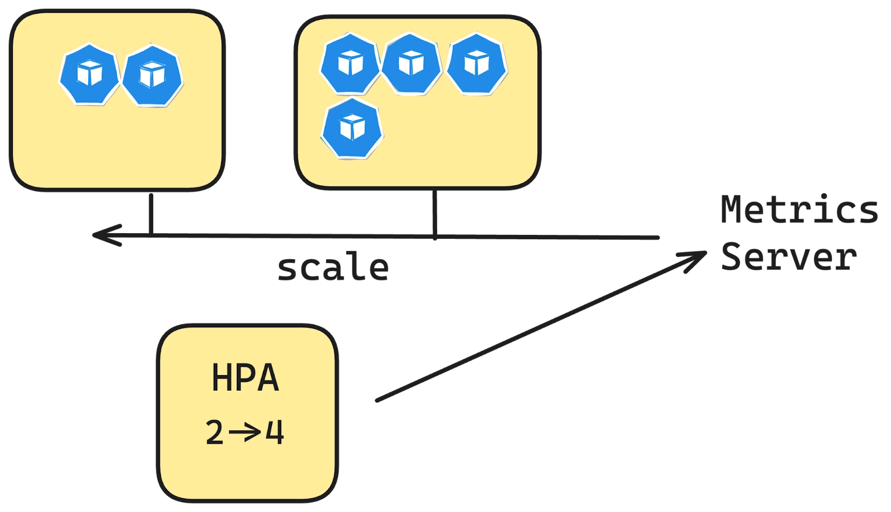

The Horizontal Pod Autoscaler (HPA) is a Kubernetes resource that automatically scales the number of pods in a deployment, replica set, or stateful set based on observed metrics, such as CPU or memory utilization. It’s part of Kubernetes’ built-in autoscaling capabilities and works by adjusting the replicas field of a target resource to maintain a specified performance threshold.


- Control Loop: The HPA controller uses a control loop mechanism to query metrics and adjust replicas accordingly.
- Metrics Collection: It retrieves metrics from the Kubernetes Metrics API (metrics.k8s.io), custom metrics API (custom.metrics.k8s.io), or external metrics API (external.metrics.k8s.io). The Metrics Server is typically used to provide the data for standard metrics.
- Calculation Algorithm: HPA uses a straightforward formula to determine the required number of replicas: 

desiredReplicas = ceil[currentReplicas * ( currentMetricValue / desiredMetricValue )]

Example: If 2 pods are running at 80% CPU, targeting 50%, it scales to ceil[2 * (80/50)] = ceil[3.2] = 4 pods.


kubectl apply -f 
https://github.com/kubernetes-sigs/metrics-server/releases/latest/download/components.yaml
add --kubelet-insecure-tls to the deployment 

```
kubectl create namespace web-scale
cat <<EOF | kubectl apply -f -
apiVersion: apps/v1
kind: Deployment
metadata:
  name: nginx-web
  namespace: web-scale
spec:
  replicas: 2  # Start with 2 pods
  selector:
    matchLabels:
      app: nginx-web
  template:
    metadata:
      labels:
        app: nginx-web
    spec:
      containers:
      - name: nginx
        image: nginx:latest
        resources:
          requests:
            cpu: "100m"  # 0.1 CPU
          limits:
            cpu: "200m"  # 0.2 CPU
EOF
```

```
cat <<EOF | kubectl apply -f -
apiVersion: autoscaling/v2
kind: HorizontalPodAutoscaler
metadata:
  name: nginx-web
  namespace: web-scale
spec:
  scaleTargetRef:
    apiVersion: apps/v1
    kind: Deployment
    name: nginx-web
  minReplicas: 2
  maxReplicas: 6
  metrics:
  - type: Resource
    resource:
      name: cpu
      target:
        type: Utilization
        averageUtilization: 70
  behavior:
    scaleDown:
      stabilizationWindowSeconds: 60
EOF
```

- scaleTargetRef: Links the HPA to the nginx-web deployment.

- minReplicas: 2 and maxReplicas: 6: Sets the scaling range.

- averageUtilization: 70: Targets 70% CPU usage per pod.

- stabilizationWindowSeconds: 60: Waits 60 seconds before downscaling to confirm the metric drop is stable.

```
kubectl get hpa -n web-scale
kubectl expose deployment nginx-web --port=80 --type=ClusterIP -n web-scale
```

### Install k6 
```
sudo gpg -k
sudo gpg --no-default-keyring --keyring /usr/share/keyrings/k6-archive-keyring.gpg --keyserver hkp://keyserver.ubuntu.com:80 --recv-keys C5AD17C747E3415A3642D57D77C6C491D6AC1D69
echo "deb [signed-by=/usr/share/keyrings/k6-archive-keyring.gpg] https://dl.k6.io/deb stable main" | sudo tee /etc/apt/sources.list.d/k6.list
sudo apt-get update
sudo apt-get install k6
```
create load test 

```
import http from "k6/http";
import { check } from "k6";

export const options = {
  vus: 100,
  duration: '5m', // Increase duration to observe scaling
};

const BASE_URL = 'http://134.209.249.207:30968'; // Replace with your NodePort service address

function demo() {
  const url = `${BASE_URL}`;

  let resp = http.get(url);

  check(resp, {
    'endpoint was successful': (resp) => {
      if (resp.status === 200) {
        console.log(`PASS! ${url}`)
        return true
      } else {
        console.error(`FAIL! status-code: ${resp.status}`)
        return false
      }
    }
  });
}

export default function () {
  demo();
}
```

Run the test 
```
k6 run k6.yaml
kubectl get hpa -n web-scale --watch
```
